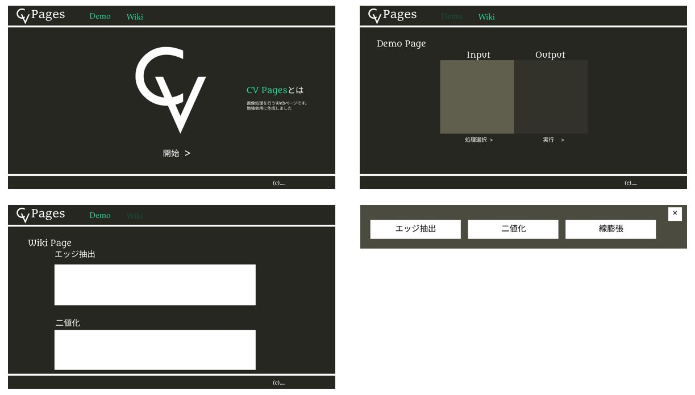

# cv-pages
画像処理, JavaScript勉強会用リポジトリ

## 目的
Webページ作成を通してHTML,CSS,JS,jQueryの知識並びにオブジェクト指向の考え方を捨てた場合の面倒さを学ぶ

## 機能
- 実際に画像処理をかけることが可能
     - 選択肢には「エッジ抽出」「二値化」「線膨張」の3種類
- 画像入力はファイル選択以外にドラッグ&ドロップも可能
     - 画像はpngとjpgのみ扱うことが可能
- 以下の場合にエラー処理が実行
     - 指定拡張子以外のファイルを入力
     - 入力せずに実行
     - 処理選択をせずに実行

## デザイン

構築を容易にするために**1920×1080のデスクトップPCのみを対象**、スマートフォンには対応していません（レスポンシブルなデザインにしていない）。